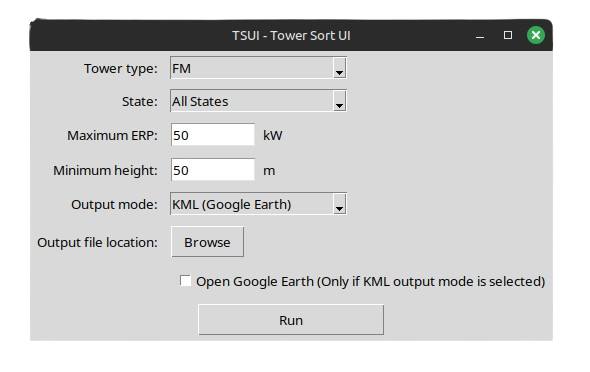

# TSUI
An application for scraping the FCC Broadcast Station database for climbable radio towers.

## Installation
TSUI can be installed [here](https://github.com/Yekc/TSUI/releases/tag/release). Simply download the executable for your operating system and run it.
